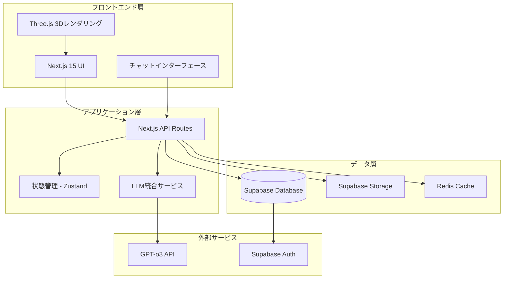

# 設計書

## 概要

医療トレーニングシミュレーターは、医学生から一般医師まで幅広いユーザーに対応する包括的な臨床訓練プラットフォームです。システムは外来・入院モードを提供し、AI生成患者ペルソナ、3Dインタラクション、電子カルテシミュレーション、リアルタイム診断ワークフローを統合します。

## アーキテクチャ

### システム全体アーキテクチャ



### 技術スタック

- **フロントエンド**: Next.js 15 (App Router), React 19, TypeScript
- **スタイリング**: Tailwind CSS 4
- **3Dレンダリング**: Three.js, React Three Fiber
- **状態管理**: Zustand
- **バックエンド**: Next.js API Routes, Supabase
- **データベース**: PostgreSQL (Supabase)
- **認証**: Supabase Auth
- **LLM統合**: OpenAI GPT-o3 API
- **リアルタイム通信**: Supabase Realtime
- **テスト**: Vitest (単体テスト), Playwright (E2Eテスト)
- **キャッシュ**: Redis (Upstash)

## コンポーネントとインターフェース

### 主要コンポーネント

#### 1. 患者生成システム
```typescript
interface PatientPersona {
  id: string;
  demographics: {
    age: number;
    gender: string;
    occupation: string;
  };
  medicalHistory: {
    chiefComplaint: string;
    historyOfPresentIllness: string;
    pastMedicalHistory: string[];
    medications: string[];
    allergies: string[];
    familyHistory: string[];
    socialHistory: string;
  };
  physicalExam: {
    vitals: VitalSigns;
    generalAppearance: string;
    systemicFindings: Record<string, string>;
  };
  geneticData: GeneticProfile;
  underlyingDiagnosis: string;
  difficulty: 'beginner' | 'intermediate' | 'advanced';
  specialty: MedicalSpecialty;
}
```

#### 2. 3D患者モデル
```typescript
interface Patient3DModel {
  modelId: string;
  position: Vector3;
  animations: Animation[];
  interactionZones: InteractionZone[];
  currentState: PatientState;
}

interface InteractionZone {
  bodyPart: string;
  geometry: Geometry;
  onInteract: (examination: ExaminationType) => ExaminationResult;
}
```

#### 3. 電子カルテシステム
```typescript
interface ElectronicMedicalRecord {
  patientId: string;
  encounters: Encounter[];
  orders: MedicalOrder[];
  results: TestResult[];
  notes: ClinicalNote[];
  medications: Prescription[];
  vitals: VitalSigns[];
}

interface MedicalOrder {
  id: string;
  type: 'lab' | 'imaging' | 'medication' | 'procedure';
  details: OrderDetails;
  status: 'pending' | 'in-progress' | 'completed' | 'cancelled';
  orderedAt: Date;
  expectedCompletionTime: Date;
}
```

#### 4. チャットシステム
```typescript
interface ChatMessage {
  id: string;
  sender: 'user' | 'patient';
  content: string;
  timestamp: Date;
  context: ChatContext;
}

interface ChatContext {
  patientId: string;
  sessionId: string;
  currentPhase: 'interview' | 'examination' | 'discussion';
}
```

### API設計

#### 患者生成API
```typescript
// POST /api/patients/generate
interface GeneratePatientRequest {
  specialty: MedicalSpecialty;
  difficulty: DifficultyLevel;
  specificDisease?: string;
  mode: 'outpatient' | 'inpatient';
}

interface GeneratePatientResponse {
  patient: PatientPersona;
  initialQuestionnaire: QuestionnaireData;
  modelConfiguration: Model3DConfig;
}
```

#### チャットAPI
```typescript
// POST /api/chat/message
interface ChatMessageRequest {
  patientId: string;
  message: string;
  context: ChatContext;
}

interface ChatMessageResponse {
  response: string;
  updatedPatientData: Partial<PatientPersona>;
  suggestedActions: string[];
}
```

#### 検査オーダーAPI
```typescript
// POST /api/orders/create
interface CreateOrderRequest {
  patientId: string;
  orderType: OrderType;
  parameters: OrderParameters;
}

interface CreateOrderResponse {
  orderId: string;
  estimatedCompletionTime: Date;
  cost: number;
}
```

## データモデル

### データベーススキーマ

```sql
-- ユーザー管理
CREATE TABLE users (
  id UUID PRIMARY KEY DEFAULT gen_random_uuid(),
  email VARCHAR UNIQUE NOT NULL,
  role VARCHAR NOT NULL DEFAULT 'student',
  created_at TIMESTAMP DEFAULT NOW()
);

-- 患者ペルソナ
CREATE TABLE patients (
  id UUID PRIMARY KEY DEFAULT gen_random_uuid(),
  user_id UUID REFERENCES users(id),
  persona_data JSONB NOT NULL,
  underlying_diagnosis VARCHAR NOT NULL,
  difficulty VARCHAR NOT NULL,
  specialty VARCHAR NOT NULL,
  created_at TIMESTAMP DEFAULT NOW()
);

-- シミュレーションセッション
CREATE TABLE simulation_sessions (
  id UUID PRIMARY KEY DEFAULT gen_random_uuid(),
  user_id UUID REFERENCES users(id),
  patient_id UUID REFERENCES patients(id),
  mode VARCHAR NOT NULL,
  status VARCHAR DEFAULT 'active',
  started_at TIMESTAMP DEFAULT NOW(),
  ended_at TIMESTAMP,
  score INTEGER,
  feedback JSONB
);

-- 医療オーダー
CREATE TABLE medical_orders (
  id UUID PRIMARY KEY DEFAULT gen_random_uuid(),
  session_id UUID REFERENCES simulation_sessions(id),
  order_type VARCHAR NOT NULL,
  order_details JSONB NOT NULL,
  status VARCHAR DEFAULT 'pending',
  created_at TIMESTAMP DEFAULT NOW(),
  completed_at TIMESTAMP
);

-- 検査結果
CREATE TABLE test_results (
  id UUID PRIMARY KEY DEFAULT gen_random_uuid(),
  order_id UUID REFERENCES medical_orders(id),
  result_data JSONB NOT NULL,
  generated_at TIMESTAMP DEFAULT NOW()
);

-- チャット履歴
CREATE TABLE chat_messages (
  id UUID PRIMARY KEY DEFAULT gen_random_uuid(),
  session_id UUID REFERENCES simulation_sessions(id),
  sender VARCHAR NOT NULL,
  message TEXT NOT NULL,
  context JSONB,
  created_at TIMESTAMP DEFAULT NOW()
);
```

### 状態管理

```typescript
interface AppState {
  // 現在のセッション
  currentSession: SimulationSession | null;
  
  // 患者管理
  activePatients: PatientPersona[];
  currentPatientId: string | null;
  
  // UI状態
  currentView: 'patient-selection' | 'simulation' | 'results';
  sidebarOpen: boolean;
  
  // チャット状態
  chatMessages: ChatMessage[];
  chatLoading: boolean;
  
  // 検査・オーダー状態
  pendingOrders: MedicalOrder[];
  completedResults: TestResult[];
  
  // 3Dモデル状態
  modelLoaded: boolean;
  currentInteraction: InteractionZone | null;
}
```

## エラーハンドリング

### エラー分類と対応

1. **LLM API エラー**
   - レート制限: 指数バックオフによるリトライ
   - API障害: フォールバック応答の提供
   - 不適切な応答: コンテンツフィルタリングと再生成

2. **3Dレンダリングエラー**
   - WebGL非対応: 2Dフォールバックモード
   - モデル読み込み失敗: デフォルトモデルの使用
   - パフォーマンス問題: 品質設定の自動調整

3. **データベースエラー**
   - 接続エラー: 自動再接続とローカルキャッシュ
   - データ整合性エラー: トランザクションロールバック
   - 容量制限: データアーカイブ機能

4. **ユーザー入力エラー**
   - 不正な医療用語: 候補提案機能
   - 空の入力: バリデーションとガイダンス
   - セッションタイムアウト: 自動保存と復元

### エラー監視

```typescript
interface ErrorTracker {
  logError(error: Error, context: ErrorContext): void;
  reportMetrics(): ErrorMetrics;
  alertOnCritical(threshold: number): void;
}

interface ErrorContext {
  userId: string;
  sessionId: string;
  action: string;
  timestamp: Date;
  userAgent: string;
}
```

## テスト戦略

### テストピラミッド

1. **単体テスト (Vitest)**
   - ユーティリティ関数
   - データ変換ロジック
   - 状態管理ロジック
   - API エンドポイント

2. **統合テスト**
   - LLM統合テスト
   - データベース操作テスト
   - 外部API統合テスト

3. **E2Eテスト (Playwright)**
   - ユーザーフロー全体
   - 患者生成から評価まで
   - マルチ患者管理
   - 3Dインタラクション

### テスト環境

```typescript
// テスト用モックデータ
interface MockPatientData {
  standardPatients: PatientPersona[];
  testScenarios: TestScenario[];
  expectedResults: ExpectedResult[];
}

// LLMモック
interface MockLLMService {
  generatePatient(params: GenerateParams): PatientPersona;
  generateResponse(message: string, context: Context): string;
  generateTestResults(order: MedicalOrder): TestResult;
}
```

### パフォーマンステスト

- **3Dレンダリング**: 60fps維持、メモリ使用量監視
- **LLM応答時間**: 平均3秒以内、最大10秒
- **データベースクエリ**: 平均100ms以内
- **同時ユーザー**: 100ユーザー同時接続対応

## セキュリティ考慮事項

### データ保護
- 患者データの暗号化（保存時・転送時）
- 個人識別情報の匿名化
- GDPR準拠のデータ削除機能

### アクセス制御
- ロールベースアクセス制御（RBAC）
- セッション管理とタイムアウト
- API レート制限

### LLM セキュリティ
- プロンプトインジェクション対策
- 出力コンテンツフィルタリング
- 医療情報の適切性検証

## 拡張性設計

### 水平スケーリング
- ステートレスAPI設計
- データベース読み取りレプリカ
- CDNによる静的アセット配信

### 機能拡張
- プラグインアーキテクチャ
- 新しい医療専門分野の追加
- カスタム評価基準の実装

### 国際化対応
- 多言語サポート（i18n）
- 地域別医療基準対応
- タイムゾーン対応